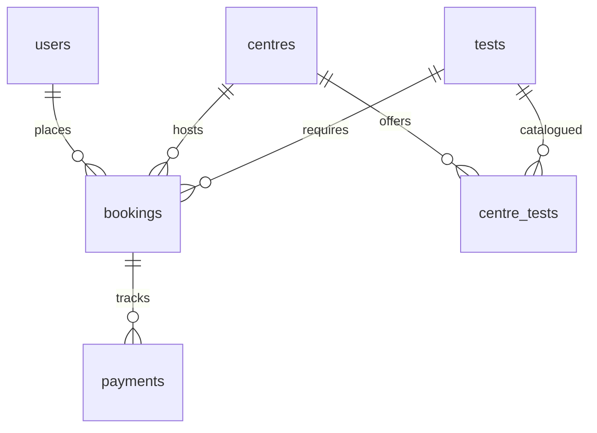

# EVE Diagnostics Backend

I built this RESTful API service to manage diagnostic centres, test catalogues, appointment bookings, and payment webhooks. I used FastAPI, SQLAlchemy 2.0, Alembic, PostgreSQL, pytest, and Docker.

## Quick start with Docker
Clone the repository and spin up the API and Database containers:
```bash
git clone <repository-url>
docker compose up --build -d
```
Once they start, run the seed script to populate initial data:
```bash
docker compose exec api python -m app.scripts.seed
```
You can view the endpoints at [http://localhost:8000/docs](http://localhost:8000/docs). I included an admin user in the seed script based on the `ADMIN_EMAIL` and `ADMIN_PASSWORD` environment variables. I skipped creating an endpoint to register admin users manually.

## Local development without Docker
To run the code natively:
1. Create and activate a virtual environment:
   ```bash
   python -m venv venv
   source venv/bin/activate  # On Windows PowerShell: .\venv\Scripts\activate
   ```
2. Copy the example configuration:
   ```bash
   cp .env.example .env  # On Windows PowerShell: Copy-Item .env.example .env
   ```
3. Open `.env` and change `DATABASE_URL` to point to `localhost:5432`. The `db` hostname is only for Docker.
4. Install dependencies, start the database, and run migrations:
   ```bash
   pip install -r requirements.txt
   docker compose up -d db
   alembic upgrade head
   ```
5. Start Uvicorn:
   ```bash
   uvicorn app.main:app --reload
   ```
6. Run the tests:
   ```bash
   python -m pytest -q
   ```

## Configuration
I set up the following environment variables. The values below are fake examples.

| Variable | Required | Description | Example |
| -------- | -------- | ----------- | ------- |
| `DATABASE_URL` | Yes | DB connection string | `postgresql+psycopg://eve_user:eve_password@db:5432/eve_db` |
| `SECRET_KEY` | Yes | JWT signing key | `fake_secret_key` |
| `JWT_ALGORITHM` | No | JWT algorithm (defaults to HS256) | `HS256` |
| `ACCESS_TOKEN_EXPIRE_MINUTES` | No | JWT expiration (defaults to 30) | `30` |
| `WEBHOOK_SECRET` | Yes | Webhook HMAC secret | `fake_webhook_secret` |
| `ADMIN_EMAIL` | Yes | Seeded admin email | `admin@eve.com` |
| `ADMIN_PASSWORD` | Yes | Seeded admin password | `adminpassword` |

## API reference
I implemented pagination (`page`, `page_size`) and filters for list endpoints.

| Method | Path | Auth | Body | Purpose |
| ------ | ---- | ---- | ---- | ------- |
| POST | `/auth/signup` | Public | email, password, full_name | Register a new user |
| POST | `/auth/login` | Public | email, password | Obtain JWT token |
| GET | `/auth/me` | User | None | Get current user profile |
| GET | `/tests` | Public | None | List tests |
| POST | `/tests` | Admin | name, description | Create a new test |
| GET | `/centres` | Public | None | List centres (filter: location) |
| POST | `/centres` | Admin | name, location, address | Create a new centre |
| GET | `/centres/{centre_id}` | Public | None | View a centre and its tests |
| POST | `/centres/{centre_id}/tests` | Admin | test_id, price | Add a test to a centre |
| PATCH | `/centres/{centre_id}/tests/{test_id}` | Admin | price | Update test price |
| GET | `/bookings` | User | None | List bookings (filter: status) |
| POST | `/bookings` | User | centre_id, test_id, appointment_at | Create a booking |
| GET | `/bookings/{booking_id}` | User | None | View a booking |
| POST | `/bookings/{booking_id}/cancel` | User | None | Cancel an active booking |
| POST | `/payments/` | User | booking_id, simulate | Simulate a payment |
| POST | `/payments/webhook/` | HMAC | event_id, provider_ref, status | Process payment webhooks |
| GET | `/health` | Public | None | DB-aware health check |

### Examples
In bash, run these to step through the main flow. 
*Note for PowerShell: use `curl.exe`, escape internal JSON quotes (e.g. `\"email\"`), and store variables like `$TOKEN = (curl.exe ... | python -c "...")`.*

```bash
# Signup
curl -X POST http://localhost:8000/auth/signup -H "Content-Type: application/json" -d '{"email":"student1@eve.com", "password":"password123", "full_name":"Student"}'

# Login and save token
TOKEN=$(curl -s -X POST http://localhost:8000/auth/login -H "Content-Type: application/json" -d '{"email":"student1@eve.com", "password":"password123"}' | python -c "import sys, json; print(json.load(sys.stdin)['access_token'])")

# List Centres
curl -X GET http://localhost:8000/centres

# Create Booking and save ID
BOOKING_ID=$(curl -s -X POST http://localhost:8000/bookings -H "Authorization: Bearer $TOKEN" -H "Content-Type: application/json" -d '{"centre_id": 1, "test_id": 1, "appointment_at": "2026-12-01T10:00:00Z"}' | python -c "import sys, json; print(json.load(sys.stdin)['id'])")

# Pay and save provider ref
PROVIDER_REF=$(curl -s -X POST http://localhost:8000/payments/ -H "Authorization: Bearer $TOKEN" -H "Content-Type: application/json" -d "{\"booking_id\": $BOOKING_ID, \"simulate\": \"pending\"}" | python -c "import sys, json; print(json.load(sys.stdin)['provider_ref'])")

# Webhook (first time returns "processed", second time returns "already_processed")
docker compose exec api python -m app.scripts.send_webhook --provider-ref $PROVIDER_REF --status SUCCESS --event-id evt_abc123
docker compose exec api python -m app.scripts.send_webhook --provider-ref $PROVIDER_REF --status SUCCESS --event-id evt_abc123
```

## Database design

The users table stores accounts and has a unique index on the email column. The tests table holds the test catalogue and has a unique index on the name column. I indexed the location column in the centres table for faster geographical queries.

The centre_tests table maps tests to centres. I added a unique constraint on (centre_id, test_id). The price is a Numeric(10,2) with a check constraint for price > 0.

The bookings table stores appointments. I snapshotted the price into an amount field as a Numeric(10,2). I used a Python Enum check constraint for the status.

The payments table tracks payment attempts. The amount is a Numeric(10,2). I created a partial unique index on booking_id where status = 'SUCCESS' to enforce one successful payment per booking at the database level.

The webhook_events table logs payloads. The event_id is unique for idempotency. I didn't add a foreign key to payments because provider_ref is stored as plain text.

## Design decisions
I centralized the booking state machine logic in `change_status`. PENDING transitions to CONFIRMED, FAILED, or CANCELLED. FAILED transitions to CONFIRMED or CANCELLED. CONFIRMED transitions to CANCELLED. CANCELLED is final. A FAILED booking can become CONFIRMED if a payment retry succeeds. A CONFIRMED booking can never become FAILED, so a late failure webhook won't undo a paid appointment. Both the payment endpoint and the webhook use the shared `apply_payment_result` function to update state.

To make webhooks idempotent, I used `INSERT ... ON CONFLICT DO NOTHING` on the `webhook_events.event_id` in a single transaction. I verify the HMAC signature against the raw request body to prevent tampering. I lock the booking row `FOR UPDATE` before evaluating the payment row to stop race conditions, and I insert the event and change the status in one transaction.

I snapshot the test price into the booking `amount` field at creation. If an admin changes the test price later, existing bookings keep their original price. When users try to view or pay for someone else's booking, I return a 404 instead of a 403 to hide the booking's existence.

I switched to psycopg 3 because psycopg2 would not install on Windows. Since bcrypt rejects passwords over 72 bytes, I validate the password bytes rather than characters. 

## Edge cases handled
| Edge Case | Behaviour | Status | Test Name |
| --------- | --------- | ------ | --------- |
| Duplicate active booking | Reject posting identical active centre+test+time | 409 | `test_duplicate_active_booking` |
| Cancel past booking | Reject cancellation if appointment is in the past | 409 | `test_cancel_past_booking` |
| Cancel already cancelled | Reject repeat cancellations | 409 | `test_cancel_booking` |
| Invalid state transition | Prevent illegal flows | 409 | `test_state_machine_transitions` |
| Other user booking | Hide existence of bookings not owned by user | 404 | `test_payment_other_user_booking` |
| Pay confirmed booking | Reject payment creation for terminal bookings | 409 | `test_payment_confirmed_booking` |
| Missing/Invalid webhook sig | Reject webhooks without valid HMAC signatures | 401 | `test_webhook_bad_signature` |
| Duplicate webhook event | Idempotently return already_processed | 200 | `test_webhook_idempotency_same_event` |
| Late webhook failure | Ignore failure events if payment is already SUCCESS | 200 | `test_webhook_failed_after_success` |

## Assumptions
I assume each booking is for exactly one test. All payments are simulated. Clients use timezone-aware ISO8601 datetimes. 

## Testing
Run the suite with `python -m pytest -q`. I wrote 72 passing tests. 

My first test setup broke when the app code called rollback, so the tests now run inside a savepoint. The concurrency tests commit real data on their own connection and clean up afterwards to catch race conditions. I tested the same event firing twice and SUCCESS vs FAILED racing.

## What I would improve
- I didn't add a mechanism to expire stale PENDING payments, so a payment stuck in PENDING blocks new attempts until a webhook arrives.
- I skipped building a refund flow for the paid-after-cancel case.
- I would add Celery with retries to process webhooks outside the request-response cycle.
- I would cache the read-heavy `/centres` list in Redis.
- I would rate limit the auth and payment endpoints.
- I didn't add slot capacity, so two people can book the same time.
- I would add support for rotating the webhook secret.
- I would configure a CI pipeline for automated testing.
