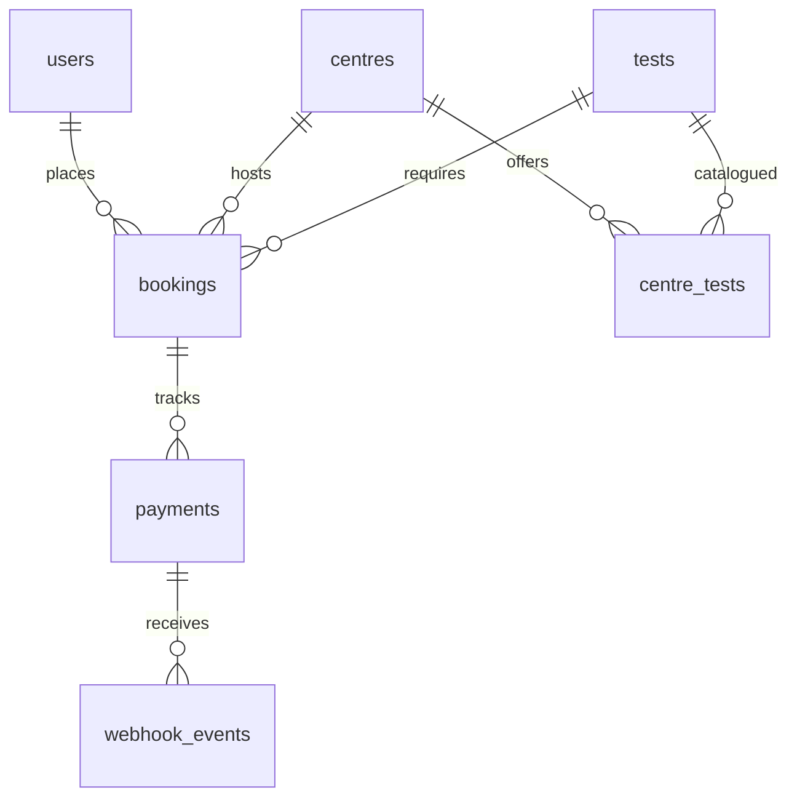

# EVE Diagnostics Backend

## 1. Overview
EVE Diagnostics Backend is a RESTful API service that manages diagnostic centres, test catalogues, appointment bookings, and payment webhook processing. The stack is built on FastAPI and SQLAlchemy 2.0 with Alembic for migrations, uses PostgreSQL for persistence, includes a comprehensive `pytest` suite, and is fully containerized with Docker.

## 2. Quick start with Docker
Clone the repository and run the following command to build and start the API and Database containers:
```bash
docker compose up --build -d
```
Once the containers are up, run the seed script to populate initial data:
```bash
docker compose exec api python -m app.scripts.seed
```
You can access the Swagger UI documentation at: [http://localhost:8000/docs](http://localhost:8000/docs)
**Note:** An admin user is automatically created during seeding using the `ADMIN_EMAIL` and `ADMIN_PASSWORD` environment variables. There is no endpoint to create an admin user manually.

## 3. Local development without Docker
To run the application locally outside of Docker:
1. Create a virtual environment and install dependencies:
   ```bash
   python -m venv venv
   source venv/bin/activate  # On Windows PowerShell: .\venv\Scripts\activate
   pip install -r requirements.txt
   ```
2. Start only the PostgreSQL database using Docker Compose:
   ```bash
   docker compose up -d db
   ```
3. Run Alembic migrations to set up the schema:
   ```bash
   alembic upgrade head
   ```
4. Start the application:
   ```bash
   uvicorn app.main:app --reload
   ```
5. Run the test suite:
   ```bash
   python -m pytest -q
   ```

## 4. Configuration
The application reads the following environment variables (all values below are fake examples for development):

| Variable | Required | Description | Example |
| -------- | -------- | ----------- | ------- |
| `DATABASE_URL` | Yes | PostgreSQL connection string | `postgresql+psycopg://eve_user:eve_password@db:5432/eve_db` |
| `SECRET_KEY` | Yes | Key for signing JWT tokens | `fake_secret_key_for_compose_only_replace_me` |
| `JWT_ALGORITHM` | No (Default: HS256) | Algorithm for JWT tokens | `HS256` |
| `ACCESS_TOKEN_EXPIRE_MINUTES` | No (Default: 30) | JWT token expiration time | `30` |
| `WEBHOOK_SECRET` | Yes | Secret for verifying webhook HMAC signatures | `fake_webhook_secret_for_compose_only` |
| `ADMIN_EMAIL` | Yes | Seeded admin account email | `admin@eve.com` |
| `ADMIN_PASSWORD` | Yes | Seeded admin account password | `adminpassword` |

## 5. API reference

| Method | Path | Auth | Purpose |
| ------ | ---- | ---- | ------- |
| POST | `/auth/signup` | Public | Register a new user |
| POST | `/auth/login` | Public | Obtain JWT token |
| GET | `/centres` | Public | List diagnostic centres |
| POST | `/centres` | Admin | Create a new centre |
| GET | `/tests` | Public | List available tests |
| POST | `/tests` | Admin | Create a new test |
| POST | `/centres/{id}/tests/{t_id}` | Admin | Add a test to a centre with a price |
| GET | `/bookings` | User | List user's bookings |
| POST | `/bookings` | User | Create an appointment booking |
| POST | `/bookings/{id}/cancel` | User | Cancel an active booking |
| POST | `/payments/` | User | Simulate a payment |
| POST | `/payments/webhook/` | HMAC Signature | Webhook for payment events |

### Main Flow Examples
*Note: In Windows PowerShell, use `curl.exe` instead of `curl` and escape JSON double quotes (e.g. `-d "{\`"email\`":\`"...\`"\}").*

**Signup:**
```bash
curl -X POST http://localhost:8000/auth/signup \
  -H "Content-Type: application/json" \
  -d '{"email":"testcurl1@eve.com", "password":"password123", "full_name":"Test Curl"}'
```

**Login:**
```bash
curl -X POST http://localhost:8000/auth/login \
  -H "Content-Type: application/json" \
  -d '{"email":"testcurl1@eve.com", "password":"password123"}'
# Keep the returned access_token for the next steps
```

**List Centres:**
```bash
curl -X GET http://localhost:8000/centres
```

**Create Booking:**
```bash
curl -X POST http://localhost:8000/bookings \
  -H "Authorization: Bearer <TOKEN>" \
  -H "Content-Type: application/json" \
  -d '{"centre_id": 1, "test_id": 1, "appointment_at": "2026-12-01T10:00:00Z"}'
# Keep the returned booking id
```

**Simulate Pending Payment:**
```bash
curl -X POST http://localhost:8000/payments/ \
  -H "Authorization: Bearer <TOKEN>" \
  -H "Content-Type: application/json" \
  -d '{"booking_id": 1, "simulate": "pending"}'
# Keep the returned provider_ref
```

**Send Webhook:**
Use the provided python script to properly sign and send the webhook payload.
```bash
docker compose exec api python -m app.scripts.send_webhook --provider-ref <PROVIDER_REF> --status SUCCESS
```

## 6. Database design



- **`users`**: Stores user accounts. Contains a unique index on `email`. `is_admin` boolean dictates access to management endpoints.
- **`tests`**: The central tests catalogue. Enforces a unique index on the `name` column.
- **`centres`**: Diagnostic centres. Has an index on the `location` column to speed up geographical or city-based searches.
- **`centre_tests`**: Junction table representing tests offered by a centre. Enforces a unique constraint on `(centre_id, test_id)`. The `price` column is a `Numeric(10,2)` with a `CheckConstraint` ensuring `price > 0`.
- **`bookings`**: Records appointments. The `amount` field snapshots the price (`Numeric(10,2)`). The `status` column enforces allowed states via a Python Enum `CheckConstraint`.
- **`payments`**: Records payment attempts and states. `amount` is `Numeric(10,2)`. A crucial **partial unique index** on `booking_id` where `status = 'SUCCESS'` guarantees at most one successful payment per booking at the database level.
- **`webhook_events`**: Idempotency log for webhook payloads. Enforces a unique index on `event_id`.

## 7. Design decisions

- **Booking state machine:** Centralized allowed transitions logic in the service layer (`PENDING -> CONFIRMED`, `PENDING -> FAILED`, `CONFIRMED -> CANCELLED`, etc.) prevents invalid flows (e.g. a late failure event after a successful payment).
- **Shared `apply_payment_result`:** Webhooks and synchronous simulation endpoints both use the exact same state machine logic to alter payments and bookings, eliminating disparate behavior.
- **Webhook idempotency:** An `INSERT ... ON CONFLICT DO NOTHING` on the `webhook_events.event_id` ensures that duplicate webhook deliveries are safely ignored within a single database transaction.
- **HMAC Signature:** Webhook bodies are parsed raw to verify an HMAC SHA-256 signature against the exact bytes, preventing tampering and payload discrepancies.
- **Lock ordering:** Processing payments always locks the `Booking` row `FOR UPDATE` before evaluating payment state. This prevents race conditions where two concurrent webhooks attempt to fulfill the same booking.
- **Price snapshotting:** Bookings copy the current price into their `amount` field upon creation. If a centre administrator changes test pricing later, existing bookings retain their agreed-upon price.
- **404 instead of 403 for bookings:** When a user queries a booking belonging to someone else, the API returns a 404 Not Found to prevent leaking the existence of booking IDs.
- **Partial Unique Index:** Ensures data integrity by rejecting a second `SUCCESS` payment for a booking directly at the PostgreSQL constraint level, preventing double charging bugs even if application locks fail.

## 8. Edge cases handled

| Edge Case | Behaviour | Status | Test Name |
| --------- | --------- | ------ | --------- |
| Duplicate active booking | Reject posting identical active centre+test+time | 409 | `test_duplicate_active_booking` |
| Cancel past booking | Reject cancellation if appointment is in the past | 409 | `test_cancel_past_booking` |
| Cancel already cancelled | Reject repeat cancellations | 409 | `test_cancel_booking` |
| Invalid state transition | Prevent illegal flows (e.g. Confirmed -> Failed) | 409 | `test_state_machine_transitions` |
| Unknown / Other user booking | Hide existence of bookings not owned by user | 404 | `test_payment_other_user_booking` |
| Pay confirmed/cancelled booking| Reject payment creation for terminal bookings | 409 | `test_payment_confirmed_booking` |
| Missing/Invalid webhook sig | Reject webhooks without valid HMAC signatures | 401 | `test_webhook_bad_signature` |
| Duplicate webhook event | Idempotently return already_processed | 200 | `test_webhook_idempotency_same_event` |
| Late webhook failure | Ignore failure events if payment is already SUCCESS | 200 | `test_webhook_failed_after_success` |

## 9. Assumptions
- **One test per booking:** The system models one test per booking rather than a shopping cart of multiple tests.
- **No slot capacity:** Centres have infinite availability for any datetime.
- **Simulated payments only:** Real Stripe/Adyen SDKs are mocked out using a `simulate` payload parameter.
- **Timezone-aware:** All clients provide and expect strict ISO8601 UTC datetimes.

## 10. Testing
Run the suite using `python -m pytest -q`.
The suite contains **72** passing tests. Concurrency edge cases (`test_webhook_concurrency`) spawn parallel threads that intentionally wait on a threading barrier to execute simultaneously against a dedicated PostgreSQL engine connection pool, ensuring locks and database constraints operate correctly in real-world race conditions.

## 11. What I would improve with more time
- **Expiring PENDING payments:** A cron job or Celery beat task to timeout stuck PENDING payments, as they currently block new payment attempts until a webhook resolves them.
- **Refund flow:** If a user cancels a CONFIRMED booking, trigger a refund via the payment provider and track the `REFUNDED` state.
- **Celery with retries:** Offload synchronous webhook database processing to Celery workers for better API latency and automated exponential backoff on DB lock timeouts.
- **Redis caching:** Cache read-heavy catalogue endpoints (`/centres`, `/tests`) to reduce DB load.
- **Rate limiting:** Implement `slowapi` or Redis-based rate limiting on `/auth` and `/payments` to prevent brute force and DDoS.
- **Appointment slot capacity:** Add a robust scheduling engine to track centre opening hours and concurrent slot availability.
- **Webhook secret rotation:** Support multiple active webhook secrets simultaneously to allow seamless provider secret rotation.
- **CI pipeline:** Add GitHub Actions for automated linting, pytest, and Docker builds on pull requests.
